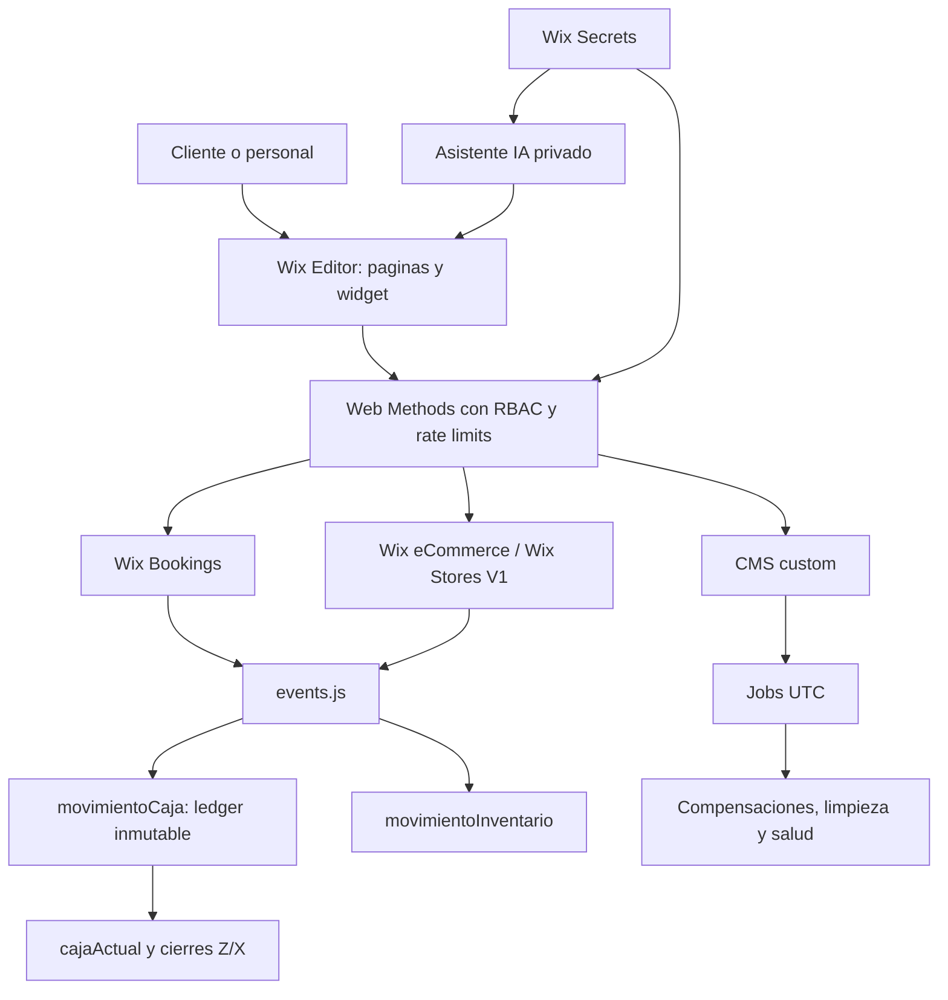

# Biblia Operativa del Ecosistema Wix v20

**Estado:** Línea base técnica consolidada para QA y evolución controlada.
**Sitio de referencia:** Marian Madrid Peluquería y Estética (`188bed94-177c-4bc9-a9f0-35080d874f3e`).
**Rama de referencia:** `qa/wix-engine-hardening-20260825`.

## 1. Principio rector

El ecosistema se considera coherente cuando cada dato, proceso y decisión tiene **una fuente de verdad** y una única ruta propietaria de escritura. La interfaz recoge intención; los módulos backend validan, recalculan, persisten y responden. Las aplicaciones nativas de Wix siguen siendo propietarias de sus entidades nativas, mientras que las colecciones personalizadas guardan proyecciones, idempotencia, auditoría o recuperación.

> La calidad se demuestra mediante pruebas, Local Editor, preview y ensayos QA controlados. El código no certifica por sí solo cumplimiento fiscal, laboral o de protección de datos.

La nomenclatura, objetivos de negocio y principios de implementación de `DIRECTRICES_Y_OBJETIVOS_V19.md` continúan vigentes. Este documento los integra con las aplicaciones, configuraciones y contratos CMS efectivamente usados por el runtime. El estado de consolidación, controles aplicados y requisitos previos de operación se registra en [`CONSOLIDACION_ECOSISTEMA_2026-08-25.md`](CONSOLIDACION_ECOSISTEMA_2026-08-25.md).

## 2. Inventario de sitio y aplicaciones nativas

| Elemento | Estado canónico | Responsabilidad |
|---|---|---|
| Wix Editor + Velo | Activo | Runtime de páginas, backend, Jobs, secretos y datos custom. |
| Wix Bookings | Instalado | Servicios, recursos, slots y entidades de reserva nativas. |
| Wix Stores, catálogo V1 | Instalado | Productos, variantes, pedidos y stock comercial nativos. No usar rutas de catálogo V3 sin migración independiente. |
| Wix Forms & Payments | Instalado | Cobro nativo y origen de eventos eCommerce. |
| Wix Members Area | Instalado | Sesión del miembro, roles y acceso a personal. |
| Wix Invoices | Instalado | Aplicación de facturas; el backend actual no escribe directamente en ella. |
| Wix Gift Cards, Blog y Promote SEO | Instaladas | Fuera del motor transaccional mientras no exista un módulo propietario que las integre. |

El sitio opera en `Europe/Madrid`, idioma `es`, país `ES` y moneda `EUR`. Estas propiedades deben coincidir con `SDK_CONFIG.TZ`, el formateo de fechas y los cálculos de día contable.

## 3. Fuentes de verdad y rutas propietarias

| Dominio | Fuente de verdad | Proyección o apoyo custom | Ruta propietaria |
|---|---|---|---|
| Servicios, disponibilidad y reservas | Wix Bookings | `Import2`, `DualSlotCache`, `CitasF2`, `BookingTransactions`, `MM_LOCKS` | `reservas.web.js` -> `citasManager.web.js` -> `bookingSaga.js` -> `bookingCore.js` |
| Pedidos, checkout, pagos y devoluciones | Wix eCommerce y señales nativas de pago/pedido | `movimientoCaja`, `PendingCompensations`, `cajaActual`, `HISTORICO_CIERRES_Z`, `RESUMEN_CONTEO_X` | `events.js` y `cajas.web.js` |
| Productos y stock comercial | Wix Stores V1 | `PRODUCTOS_VENTA` visible / `InventarioProductos` técnico, `movimientoInventario`, `ConciliacionStockWix` | `events.js` e `inventario.web.js` |
| Personal y permisos | Wix Members + CMS privado `MAPA_STAFF` | `REGISTRO_HORARIO`, selección de personal en `SERVICIOS_CITA` | `security.js`, `staff.js`, `horario.web.js` |
| Fiscal y gestoría | Ledger custom derivado de eventos verificados | `movimientoCaja` con `nifEmisor` y agregados de solo lectura | `cajas.web.js` y `fiscalAggregator.web.js` |
| Panel interno Marian | Sesión Wix Member y autorización backend | Widget HTML y datos de lectura del panel | `ONLY STAFF.mvf3f.js`, `security.web.js`, `marianAssistant.web.js` |

Los módulos de código no deben crear reservas, checkouts, movimientos fiscales, locks, compensaciones ni reconciliaciones por rutas alternativas. La lista de colecciones, campos, tipos e índices está fijada en `CMS_SCHEMA_CANONICO.md` y `tests/cms-schema-canonical.json`.

## 4. Configuración y dependencias técnicas

| Recurso | Fuente canónica | Regla de operación |
|---|---|---|
| Site ID y UI version | `wix.config.json` | El archivo actual apunta al sitio publicado. No representa por sí solo un entorno QA separado. |
| Módulos Velo nativos | Wix runtime y `wix.lock` | No ejecutar `npm install` para resolver `wix-data`, `wix-auth` u otros módulos nativos. |
| SDK público | `package.json` | `@wix/bookings` y `wix-web-module` se validan con tipos generados de Wix. |
| Parámetros backend | `src/backend/internalConfig.js` | Zona horaria, colecciones activas, enum de negocio, resource type y singleton de caja. |
| Secretos | Wix Secrets Manager y `src/backend/mmSecrets.js` | Los nombres se declaran en código; sus valores no se incluyen en Git, widgets ni CMS. `FISCAL_NIF_EMISOR` debe contener el emisor real antes de generar QR completos. |
| Esquema CMS | `tests/cms-schema-canonical.json` | Contrato machine-readable de colecciones custom activas, campos e índices. |
| Directrices | `docs/DIRECTRICES_Y_OBJETIVOS_V19.md` | Criterios de diseño, compatibilidad y evidencia. |

El catálogo de personal se gestiona desde la colección CMS privada `MapaStaff`, expuesta en código como `COLLECTIONS.MAPA_STAFF`. `staff.js` conserva una función necesaria como adaptador de acceso, caché y resolución de identidad; no lee el secreto `MAPA_STAFF`. La colección `ProveedoresInventario` tampoco pertenece al runtime activo mientras no se implemente un flujo propietario de proveedores.

### 4.1. Nomenclatura CMS y migración compatible

Los nombres visibles de las colecciones personalizadas se normalizan en **MAYÚSCULAS_CON_GUIONES_BAJOS**, en español y con una semántica de dominio inequívoca. Las claves técnicas nuevas se diseñan en **camelCase español**, sin tildes ni `ñ`; por ejemplo, `nombreProducto`, `precioVentaIvaIncluido` e `idProductoWix`. Los campos del sistema administrados por Wix (`_id`, `_createdDate`, `_updatedDate`, `_owner`) no se renombran ni se incluyen en esta política.

> La normalización semántica facilita la legibilidad, la trazabilidad y la revisión interna, pero no sustituye el formato de los registros de facturación ni certifica cumplimiento SIF o VERI*FACTU. La AEAT exige integridad, conservación, accesibilidad, legibilidad, trazabilidad e inalterabilidad de los registros de facturación; la correspondencia concreta se desarrolla en la Orden HAC/1177/2024 y sus especificaciones técnicas.[4][5]

El ID técnico de cada colección se mantiene como contrato de ejecución mientras el backend lo consulte. Cambiarlo implica crear una colección nueva, migrar datos, revisar referencias e índices y desplegar código compatible. Por esta razón, en el sitio publicado solo se admiten cambios de nombre visible tras exportar el esquema y confirmar el alcance. Wix permite actualizar `displayName` de una colección sin modificar su ID; para los campos, el parche se dirige a una `key` existente y permite actualizar su etiqueta visible.[6][7]

Una clave de campo en inglés no se reescribe directamente. El procedimiento obligatorio es: crear la clave española en QA; copiar los datos; desplegar lectura dual; verificar los flujos; empezar escritura dual o exclusiva controlada; y retirar la clave legacy únicamente después de copia de seguridad, revisión de referencias e indicación explícita. Los campos de ledger de caja, cierres Z, registro horario y auditoría se excluyen de cualquier migración de claves durante esta etapa; solamente se admiten cambios visuales compatibles.

La fuente detallada de decisiones es [`MATRIZ_CORRESPONDENCIA_CMS_CODIGO.md`](MATRIZ_CORRESPONDENCIA_CMS_CODIGO.md). El documento identifica, para cada colección y campo de inventario, el ID técnico actual, el nombre visible objetivo, la clave futura y la corrección necesaria en código. En particular, `PRODUCTOS_VENTA` es el nombre comercial visible y `InventarioProductos` se conserva como ID técnico. `COLLECTIONS.PRODUCTOS_VENTA` es el alias canónico para el catálogo y `COLLECTIONS.INVENTARIO_PRODUCTOS` sigue disponible exclusivamente por compatibilidad. `ProveedoresInventario` se conserva con nombre visible `PROVEEDORES_LISTA`; estaba vacía en la auditoría del 25 de agosto de 2026 y no puede usarse aún como fuente autorizada de proveedores para el catálogo comercial.

## 5. Eventos, Jobs y recuperación

Los listeners de `events.js` son la entrada de los eventos Wix Bookings y Wix eCommerce. Los pedidos de reserva, producto puro y mixto se reflejan en el ledger mediante una `transactionId` idempotente. Las devoluciones no generan una compensación huérfana: esperan el asiento original cuando procede.

| Job | Frecuencia UTC | Propósito | Dependencias |
|---|---:|---|---|
| `cleanExpiredLocks` | cada hora, minuto 15 | Eliminar locks vencidos | `MM_LOCKS` |
| `cleanupExpiredDualCache` | cada hora, minuto 20 | Eliminar parejas F1/F2 vencidas | `DualSlotCache` |
| `runPendingCompensationsJob` | cada hora, minuto 30 | Reintentar compensaciones de reservas y ledger | `PendingCompensations`, `BookingTransactions`, `movimientoCaja` |
| `processBookingsServiceSyncJob` | cada hora, minuto 40 | Recuperar proyecciones idempotentes de catálogo hacia Bookings | `Import2`, `MapaStaff`, `BookingsServiceSyncQueue` |
| Limpieza de cachés | diaria 01:00 y 01:10 UTC | Purgar cachés de disponibilidad | `AvailabilityDaysCache`, `AvailabilitySlotsCache` |
| `verifyNightlyZClosing` | diaria 01:20 UTC | Cerrar el día anterior de Madrid tras validar la cadena | `movimientoCaja`, `HISTORICO_CIERRES_Z`, `cajaActual` |
| `cleanAuditLogs` | domingo 02:00 UTC | Aplicar retención técnica | `MM_AUDIT_LOG` |
| `systemHealthCheck` | diaria 07:00 UTC | Verificar colecciones, secretos, locks, compensaciones e integridad | Varias colecciones y secretos |

Wix interpreta la configuración de Jobs en UTC y no ejecuta frecuencias inferiores a una hora; por ello el fichero `jobs.config` no debe volver a usar cron de 10 o 15 minutos.[1] El cierre usa el día anterior de `Europe/Madrid`, de forma que su horario UTC se mantiene después del cambio de día local en horario estándar y de verano.

## 6. Arquitectura de dependencia

## 7. Entorno QA y control de cambios

El `siteId` configurado actualmente corresponde a un sitio publicado; por tanto, no se debe confundir Local Editor conectado a ese sitio con un QA aislado. Para un QA plenamente separado hace falta un sitio Wix independiente, con Bookings, Stores V1, Forms & Payments y Members Area instalados, un Site ID propio, catálogo y recursos de prueba, y secretos no productivos.

| Puerta QA | Evidencia exigida | Prohibición |
|---|---|---|
| Configuración | Site ID QA, apps, zona horaria, moneda y permisos comprobados | Reutilizar secretos productivos o apuntar scripts al sitio público. |
| Datos | Colecciones creadas desde el contrato, índices revisados y datos de prueba aislados | Renombrar o borrar datos productivos por inferencia. |
| Código | `npm run test`, `npm run sync:types`, Local Editor y preview sin errores | Usar `npm install` como validador del runtime Velo. |
| Reservas | Simple, dual, hueco de exposición, solape y compensación | Reservar clientes reales o emitir notificaciones no controladas. |
| Pagos y pedidos | Sandbox y eventos idempotentes de orden, pago y devolución | Realizar cargos, reembolsos o cierres fiscales reales. |
| Publicación | Revisión de diferencias, aceptación funcional y autorización separada | Ejecutar `wix publish` como parte de una prueba. |

## 8. Checklist de activación técnica

Antes de habilitar cada componente en QA se comprueba lo siguiente: las apps nativas están instaladas; los servicios y recursos Bookings coinciden con `Import2` y la colección privada `MapaStaff`; las colecciones activas siguen el contrato CMS; los secretos realmente requeridos existen con valores de QA; los Jobs están publicados en la configuración del sitio; la página Only Staff mantiene `#htmlOnlyStaff`; y el asistente IA solo se habilita cuando `MARIAN_ASSISTANT_OPENAI_KEY` exista en Secrets Manager.

Los secretos declarados actualmente son `SECRET_FISCALKEY`, `SECRET_AUTH_JWT_KEY`, `ADMIN_EMAILS`, `CAJERO_EMAILS`, `POWER_AUTOMATE_TOKEN`, `SENDGRID_API_KEY`, `APP_KEY`, `BOOKINGS_API_TOKEN` y `MARIAN_ASSISTANT_OPENAI_KEY`. La declaración no demuestra que el secreto exista ni que su valor sea válido; esa verificación se realiza solo en QA y sin revelar valores.

## Referencias

[1] [Wix: Schedule Jobs](https://dev.wix.com/docs/velo/articles/getting-started/schedule-jobs)

[2] [Wix: Jobs JSON Object](https://dev.wix.com/docs/develop-websites/articles/workspace-tools/developer-tools/recurring-jobs/jobs-json-object)

[3] [Wix: About the Local Editor](https://dev.wix.com/docs/develop-websites/articles/workspace-tools/developer-tools/git-integration-wix-cli-for-sites/about-the-local-editor)

[4] [AEAT: Cuestiones generales sobre Sistemas Informáticos de Facturación y VERI*FACTU](https://sede.agenciatributaria.gob.es/Sede/iva/sistemas-informaticos-facturacion-verifactu/cuestiones-generales.html)

[5] [BOE: Orden HAC/1177/2024](https://www.boe.es/diario_boe/txt.php?id=BOE-A-2024-22138)

[6] [Wix CMS: Patch Data Collection](https://dev.wix.com/docs/api-reference/business-solutions/cms/collection-management/data-collections/patch-data-collection)

[7] [Wix CMS: Patch Data Collection Field](https://dev.wix.com/docs/api-reference/business-solutions/cms/collection-management/data-collections/patch-data-collection-field)
