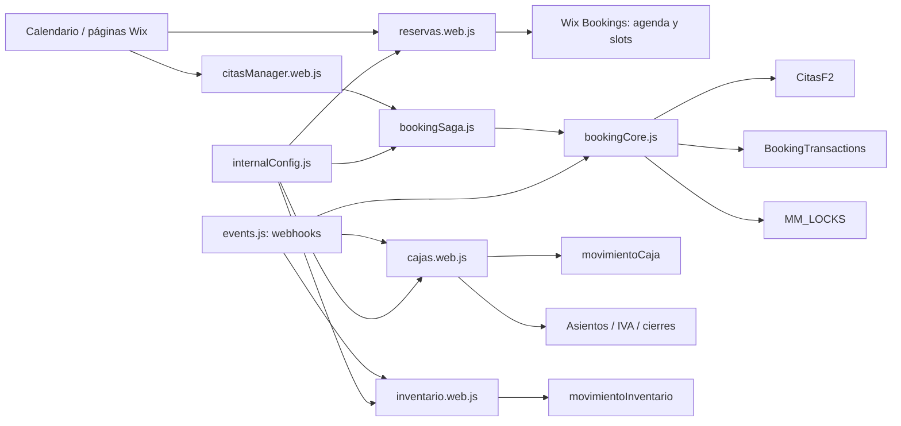

# Biblia técnica del ecosistema Wix/Velo — Fase 1

**Fecha de corte:** 28 de agosto de 2026, 01:40 UTC.  
**Autor:** Manus AI.  
**Repositorio y rama:** `nachoortegazgz/marianmadrid2002`, `main`.  
**Commit de referencia:** `d46e7cf2c4864af8c3566feb3c21706197d31496`.  
**Sitio:** [marianmadrid.es](https://www.marianmadrid.es/).  
**Sitio Wix:** `188bed94-177c-4bc9-a9f0-35080d874f3e`.

## 1. Propósito, alcance y regla de interpretación

Esta biblia técnica consolida el estado diseñado, versionado y observado del ecosistema de Marian Madrid. Su finalidad es permitir que una persona técnica, un responsable de negocio o una gestoría técnica entiendan **qué hace el sistema, con qué datos opera, cuáles son sus controles y qué evidencia respalda cada capacidad**, sin tener que reconstruir el contexto de las conversaciones ni interpretar código aislado.

> **Regla de evidencia.** Toda afirmación se clasifica como **implementada y validada en pruebas**, **observada en producción mediante consultas de solo lectura**, o **pendiente de QA end-to-end**. Una capacidad implementada no debe confundirse con certificación legal, fiscal, contable, laboral o de protección de datos.

La Fase 1 cubre reservas online simples y duales, disponibilidad nativa, huecos de exposición, pagos y ventas, caja, devoluciones, propinas, inventario, jornada, trazabilidad operativa, paquetes de apoyo para gestoría y control de acceso. La Fase 2 de integración externa con Microsoft 365 se conserva preparada en código, pero está **bloqueada por configuración** y no genera tráfico.

## 2. Instantánea del entorno real

El sitio está **publicado**, dispone de plan Premium y dominio propio; utiliza Wix Editor con Velo activado. Su contexto operativo es español, zona horaria `Europe/Madrid` y moneda `EUR`. La configuración local de Wix referencia la UI `14544`. Las aplicaciones instaladas observadas incluyen Wix Bookings, Wix Stores con catálogo V1, Wix Forms & Payments, Wix Invoices, Gift Cards, Members Area, Blog y Promote SEO.[1]

| Elemento | Valor técnico | Implicación operativa |
|---|---|---|
| Fuente de agenda | Wix Bookings | La disponibilidad, los recursos y el calendario nativo se consideran la autoridad de agenda. |
| Fuente comercial de servicios | `Import2` / nombre visible `SERVICIOS` | Define catálogo comercial, precios, duración, pagos, fases y exposición. |
| Complementos | `AddonsCatalogo` / nombre visible `EXTRAS_CATALOGO` | Mantiene addons y sus vínculos con servicios sin alterar el ID técnico. |
| Personal | `MapaStaff` | Colección privada para la correspondencia entre personal y recurso de Bookings. |
| Catálogo eCommerce | Wix Stores **V1** | Cualquier API de tienda debe respetar V1, nunca asumir catálogo V3. |
| Código | Velo ES modules y `wix-web-module` | Las fachadas `.web.js` son los límites de llamada desde las superficies de interfaz. |
| Datos de negocio | CMS Wix | Se aplican permisos de colección, hooks, roles y validación de dominio. |

La configuración está centralizada en [`src/backend/internalConfig.js`](../src/backend/internalConfig.js). Este archivo es la fuente única de IDs de colección, límites de concurrencia, expiraciones de caché, roles, estados, timeouts, moneda, tasa de IVA técnica y la bandera de M365.

## 3. Métricas de construcción, calidad y operación

Las métricas de esta sección se obtuvieron de un inventario estático del commit de referencia y de consultas CMS agregadas y de solo lectura ejecutadas contra Wix. Las agregaciones no recuperaron nombres de clientes, correos, teléfonos, importes de movimientos individuales ni secretos.

| Familia | Métrica | Valor observado | Lectura correcta |
|---|---:|---:|---|
| Código mantenido | Ficheros JavaScript bajo `src/` | **63** | Incluye backend, páginas y módulos públicos; no cuenta tipos generados de Wix. |
| Código mantenido | Líneas de código fuente | **13.304** | Medida de tamaño, no indicador de calidad aislado. |
| Backend | Módulos backend | **24** | Separación por dominio: reservas, caja, inventario, fiscalidad, seguridad, eventos y Jobs. |
| Interfaz | Páginas Wix versionadas | **35** | Los sufijos internos Wix se preservan para mantener el mapeo del Editor. |
| Pruebas | Scripts de prueba `.mjs` | **13** | El comando `npm test` encadena sanitización, núcleo, endurecimiento, widget, simulación, integración, administración, documentos, automatización y monitor. |
| Pruebas | Líneas de pruebas | **1.848** | La cobertura es por contrato y escenario; no es un porcentaje de cobertura de ramas. |
| Controles explícitos | Aserciones/comprobaciones estáticas detectadas | **331** | Indicador aproximado, útil para dimensionar contratos, no un KPI de defectos. |
| Interfaces | Exportaciones de módulos detectadas | **220** | Incluye fachadas públicas, hooks Wix, funciones internas exportadas y constantes. |
| CMS | Colecciones Wix existentes | **55** | Inventario real de la API de colecciones. |
| CMS del ecosistema | Colecciones reconocidas por la SSOT | **34** | Conjunto definido en `COLLECTIONS`; tres claves son alias intencionados que apuntan a un ID ya contado. |
| Cifrado CMS | Campos marcados `encrypted` en esas 34 colecciones | **0** | La protección actual procede de permisos, RBAC, minimización de respuesta y secretos; no de cifrado de campo configurado por el CMS. |
| Índices CMS | Índices explícitos devueltos por API | **0** | Cada colección admite hasta 3 índices regulares y 1 único, pero no constan índices declarados. Es un riesgo de rendimiento a vigilar al crecer el volumen. |

### 3.1 Métricas agregadas de contenido y operación

| Área | Métrica observada | Resultado | Interpretación y límite |
|---|---|---:|---|
| Catálogo de citas | Servicios `CITA` visibles | **69** | Publicables según `oculto:false`; la agregación no verifica todos los campos de calidad ni el estado `activo`. |
| Catálogo de citas | Servicios `CITA` ocultos | **24** | Inventario no expuesto comercialmente. |
| Reservas internas | Filas en `CitasF2` | **0** | La colección está vacía al corte; no es evidencia de ausencia de reservas históricas nativas en Wix Bookings. |
| Idempotencia de reservas | `BookingTransactions` con estado `FAILED` | **2** | Hallazgo operativo pendiente de análisis individual controlado; no se infiere causa con una agregación. |
| Locks vivos | Filas en `MM_LOCKS` | **0** | No había mutex persistente activo en el instante de consulta. |
| Compensaciones | Filas en `PendingCompensations` | **0** | No había recuperación pendiente en el instante de consulta. |
| Ledger propio | Filas en `movimientoCaja` | **0** | No se debe interpretar como caja vacía real: solo indica que el ledger propio no contiene filas al corte. |
| Cierres Z | Cierres registrados | **10** | Nueve con `CLOSED` y uno con `CERRADA`; existe heterogeneidad histórica de etiqueta de estado. |
| Inventario | Productos activos sin conciliación pendiente | **1** | Lectura de la colección interna, no del catálogo completo de Wix Stores. |
| Inventario | Movimientos internos | **0** | No se observan filas al corte. |
| Auditoría | Eventos `INFO` | **1** | Volumen bajo de auditoría persistente; debe vigilarse la retención de 90 días. |
| Sync de servicios | Cola `BookingsServiceSyncQueue` | **0** | No había sincronizaciones pendientes. |
| M365 | Cola `M365GraphSyncQueue` | **0** | Coherente con `SDK_CONFIG.M365.ENABLED === false`. |

Estas métricas son un **semáforo operativo**, no un balance contable ni una auditoría de datos. En especial, los campos CMS no cifrados y la inexistencia de índices explícitos deben mantenerse como elementos de control del crecimiento: antes de añadir datos o tráfico, se deben medir consultas críticas, definir índices solo para patrones reales y preservar la inmutabilidad de ledger y asientos.

## 4. Arquitectura funcional y fuentes de verdad

La arquitectura evita atribuir una misma responsabilidad a varias capas. `Import2` gobierna la definición comercial; Wix Bookings gobierna agenda y disponibilidad; `CitasF2` es una proyección operativa durable cuando se usa la saga Velo; `BookingTransactions` preserva idempotencia; y `movimientoCaja` es un ledger inmutable separado de la agenda.

| Dominio | Fuente autoritativa | Proyección / consumidor | Misión |
|---|---|---|---|
| Servicios | `Import2` | `reservas.web.js`, sincronización Bookings | Mantener contenido comercial y configurar servicios disponibles. |
| Addons | `AddonsCatalogo` | Reserva y páginas de servicio | Definir complementos, precio, duración, disponibilidad y enlaces a servicios. |
| Disponibilidad | Wix Bookings / Time Slots | Cachés de días, slots y pares duales | Ofrecer slots sin confiar en fechas o recursos enviados por el navegador. |
| Reserva | Booking Writer V2 | `CitasF2`, `BookingTransactions`, auditoría | Crear, confirmar, reprogramar o compensar reservas cuando se usa la saga Velo. |
| Venta online | Wix eCommerce | Eventos, ledger, inventario | Reaccionar a estado pagado, reembolso o cancelación, de forma idempotente. |
| Caja | `movimientoCaja` | Cierres X/Z, fiscalidad, documentos | Preservar orden, importes, forma de pago y cadena de integridad. |
| Inventario | `InventarioProductos` y `movimientoInventario` | Conciliación con Wix Stores | Registrar consumo, recepción, venta/reembolso online y conciliación. |
| Fiscalidad de apoyo | Ledger y colecciones de contabilidad | PDF/CSV para gestoría | Generar documentación de apoyo; no presentar declaraciones oficiales. |
| Jornada | `REGISTRO_HORARIO` | ONLY STAFF | Fichajes, historial, cálculo de horas y ajustes protegidos. |

## 5. Flujos funcionales y controles de fiabilidad

### 5.1 Reservas online simples y duales

El motor de reservas reside principalmente en [`reservas.web.js`](../src/backend/reservas.web.js), [`bookingCore.js`](../src/backend/booking/bookingCore.js), [`bookingSaga.js`](../src/backend/booking/bookingSaga.js) y [`citasManager.web.js`](../src/backend/citasManager.web.js). La interfaz no es autoridad: el backend normaliza identificadores, obtiene el servicio, revalida slot, recurso, duración, addons y disponibilidad antes de crear.

| Capacidad | Implementación | Salvaguardas |
|---|---|---|
| Simple | Obtiene servicio por slug/ID, días disponibles y slot validado. | Rate limit, normalización, revalidación exacta y error saneado. |
| Dual | Certifica dos fases desde catálogo, recurso y disponibilidad nativa. | Locks por slot/fase, token de pareja, persistencia y compensación si una fase falla. |
| Gap / exposición | `tiempoExposicion` separa F1 y F2 sin bloquear artificialmente el recurso. | Las fases y el hueco se calculan desde `Import2`, no desde el cliente. |
| Selección de profesional | `resolveStaffForSlot()` y `MapaStaff` resuelven recursos permitidos. | `nombreVisible`/datos de personal no se sustituyen por identidades hardcodeadas. |
| Sin selección | El flujo nativo puede devolver `NO_SELECTION`; la asignación posterior depende de Bookings. | Se debe distinguir de una selección explícita al documentar la experiencia. |
| Idempotencia | `BookingTransactions` con `pairToken`, `payloadHash` y estado. | Reutilizar token con payload distinto se rechaza. |
| Compensación | `PendingCompensations` conserva recuperación pendiente. | No se abandona una fase creada si falla la pareja; la cancelación es una operación explícita. |

La QA real del 27 de agosto validó la capa nativa de Bookings con un dual, una simple dentro del hueco, una simple con recurso y una sin selección. Las cinco anotaciones alcanzaron `CONFIRMED` y `NOT_PAID`, después `CANCELED`, sin checkout, pedido eCommerce ni movimientos de caja. Una variación asíncrona de revisión produjo un rechazo `INVALID_REVISION`, corregido mediante relectura de revisión y cancelación inmediata; la recuperación confirma que el control de concurrencia nativo está activo.[2]

> **Límite de cobertura.** La QA real se realizó contra Booking Writer/Reader V2 y no pasó por `processDualBooking`; por ello no creó `CitasF2`, `BookingTransactions` ni `MM_AUDIT_LOG`. La validación end-to-end de la saga Velo queda pendiente de un canal autenticado que llame a la fachada publicada.

### 5.2 Venta online, pago, devoluciones y caja

Los eventos de Wix eCommerce se reciben en [`events.js`](../src/backend/events.js). Los handlers para pago, devolución y cancelación llaman a los flujos internos que, cuando corresponde, actualizan la proyección de cita, inventario y caja de forma idempotente. El módulo [`cajas.web.js`](../src/backend/cajas.web.js) es la única ruta de registro de movimientos de caja.

| Flujo | Disparador | Registro principal | Control crítico |
|---|---|---|---|
| Pago online | Evento de pedido pagado | `movimientoCaja`, proyección de cita y/o inventario | Exige `transactionId` para forma `ONLINE`. |
| Pago presencial | Acción administrativa autorizada | `movimientoCaja` | Rechaza importe cero; clasifica efectivo, tarjeta o Bizum. |
| Devolución | Evento eCommerce de refund/cancelación | Ledger, referencia rectificativa e inventario | Idempotencia por identificador de devolución y signo negativo. |
| Propina | Operación separada | `movimientoCaja` | Tipo específico, sin IVA técnico automático hasta decisión profesional. |
| Arqueo X | Gestión de caja | `RESUMEN_CONTEO_X` | Contrasta teórico y metálico, muestra descuadre. |
| Cierre Z | Manual o Job | `HISTORICO_CIERRES_Z` | Misma implementación interna, secuencias, hash y firma. |

Cada movimiento válido construye `prevHash`, `hashCadena` y `firmaDigital` bajo un mutex global de ledger de 45 segundos. El mutex es deliberado: sacrifica paralelismo de escritura para mantener el orden de la cadena de integridad. Ningún movimiento se debe editar ni borrar para “limpiar” una prueba; la corrección debe ser compensatoria y trazable.

### 5.3 Inventario, administración, jornada y documentos

[`inventario.web.js`](../src/backend/inventario.web.js) opera inventario interno, recepción, consumo, conciliación y reflejo de eventos de venta o reembolso. [`horario.web.js`](../src/backend/horario.web.js) limita el fichaje al contexto de personal autenticado y distingue entrada, salida, inicio/fin de pausa y ajuste. `ONLY STAFF.mvf3f.js` es la superficie de equipo; `ADMINISTRACION.mvf3f.js` y `marianAdministrationController.js` concentran caja, fiscalidad de apoyo y documentación para Marian.

Los documentos de gestoría se generan con [`fiscalDocuments.web.js`](../src/backend/fiscalDocuments.web.js). El Job del día 5 prepara el PDF mensual anterior y el trimestral cuando aplica; el envío sigue siendo manual, confirmado y exclusivo de Marian. No se activa ningún proveedor de email ni se pretende generar modelos oficiales por inferencia.

## 6. Seguridad, permisos y privacidad

La seguridad combina permisos CMS, comprobaciones RBAC y minimización de datos. Las colecciones sensibles identificadas por el esquema vigente tienen `read: ADMIN`; `Import2` tiene lectura pública y `AddonsCatalogo` lectura de miembro, por lo que las fachadas públicas deben proyectar solo campos comerciales permitidos. `MapaStaff`, agenda interna, transacciones, caja, fiscalidad, inventario y auditoría son administrativas.

| Control | Implementación | Finalidad |
|---|---|---|
| RBAC | `security.js` y `security.web.js` | Distingue `ADMIN`, `GESTION` y `ESTILISTA`; Marian dispone de un recurso de gestión canónico. |
| Secretos | `mmSecrets.js` y Wix Secrets Manager | Evita credenciales en código y aplica caché de secretos de cinco minutos. |
| Rate limiting | Backend y HTTP externo | Reserva: 5 solicitudes/10 s; disponibilidad por solicitante: 12/5 s; global: 120/5 s. |
| Tokens e integridad | `securityEngine.js` | HMAC, comparación temporalmente segura, hash, cadena y JWT HS256 de 30 minutos. |
| API externa | `http-functions.js` | HMAC/Bearer, CORS limitado a los dominios de Marian y proyecciones contables mínimas. |
| Sanitización | `tests/verify-sanitization.mjs` | Detecta secretos, ejecución dinámica, errores internos en API pública, fuga de catálogo y riesgos M365. |
| Inmutabilidad | `data.js` | Rechaza modificaciones/borrados de movimiento de caja, asientos y líneas una vez protegidos. |

La última sanitización disponible fue correcta: siete de siete controles aprobaron. El esquema CMS reportó **cero campos con cifrado a nivel de campo** en las 34 colecciones mapeadas. Por tanto, toda evolución debe mantener el principio de datos mínimos, permisos correctos y respuestas externas proyectadas; no se debe asumir que un campo administrativo es seguro por el mero hecho de existir.

## 7. Constantes operativas canónicas

| Grupo | Valor vigente | Misión |
|---|---|---|
| Zona horaria y moneda | `Europe/Madrid`, `EUR` | Consistencia de slots, cierres, fechas y documentos. |
| Ubicación Bookings | `7a12abfd-bf30-4847-bcdf-00dc573d4802` | Ubicación de negocio usada por slots y Booking Writer. |
| Tipo de recurso de personal | `1cd44cf8-756f-41c3-bd90-3e2ffcaf1155` | Filtra recursos de profesional en Bookings. |
| Caché de servicios / staff | 10 min / 5 min | Reduce consultas repetitivas sin prolongar demasiado la obsolescencia. |
| Caché de slots / dual | 2 min / 15 min | Acelera disponibilidad y conserva candidatos duales certificados. |
| Timeouts API y CMS | 15.000 ms | Límite de operaciones síncronas de backend. |
| Watchdog y webhook | 30.000 ms | Previene ejecución indefinida de Jobs y eventos. |
| Mutex reserva | 120.000 ms | Reserva un slot durante la saga y reduce dobles confirmaciones. |
| Mutex ledger | 45.000 ms | Mantiene el orden de hash del ledger. |
| Ventana de búsqueda | 14 días; tolerancia 10 min | Limita coste de disponibilidad y criterio de encaje. |
| Retención de auditoría | 90 días | Parámetro de limpieza programada; no reemplaza una política legal de conservación. |
| M365 | `ENABLED: false` | Bloquea tráfico, Jobs y sincronización externa de Fase 2. |

Los estados principales son: citas `CONFIRMED`, `PENDING_PAYMENT`, `CANCELED`, `REFUNDED`; pagos `UNPAID`, `PENDING_PAYMENT`, `PENDING_LEDGER`, `PAID`, `REFUNDED`, `PARTIALLY_REFUNDED`; movimientos `VENTA_EFECTIVO`, `VENTA_TARJETA`, `VENTA_BIZUM`, `VENTA_ONLINE`, `PROPINA`, `REEMBOLSO`, `AJUSTE`; y formas de pago `EFECTIVO`, `TARJETA`, `BIZUM`, `ONLINE`.

## 8. Interfaces y módulos esenciales

El anexo de interfaces exportadas aporta el inventario completo de nombres y parámetros. Esta tabla explica la misión de los módulos de mayor responsabilidad.

| Módulo | Misión | Interfaces representativas |
|---|---|---|
| `reservas.web.js` | Disponibilidad, catálogo comercial, pares duales y selección de personal. | `getAvailableDays`, `getCertifiedDualSlots`, `revalidateExactAvailabilitySlot`, `resolveStaffForSlot`. |
| `citasManager.web.js` | Fachada de orquestación de reservas. | `processDualBooking`, confirmación de pago y reprogramación. |
| `booking/bookingCore.js` | Normalización, locks, idempotencia y persistencia durable. | Inicialización/completado de transacciones, creación de `CitasF2`, compensación. |
| `booking/bookingSaga.js` | Saga simple y dual. | Crea fases, revierte parcialmente, gestiona estado de pago/checkout y persiste resultado. |
| `events.js` | Reacción a Bookings/eCommerce. | Confirmación/cancelación de cita; pago, refund y cancelación de pedido. |
| `cajas.web.js` | Ledger y caja administrativa. | Pago de reserva, venta presencial, propina, devolución, arqueo X y cierre Z. |
| `data.js` | Hooks de colección. | Valida catálogo/personal; protege inmutabilidad de caja, asientos y jornada. |
| `inventario.web.js` | Stock y conciliación. | Consumo, recepción, cola de conciliación, venta/reembolso online. |
| `fiscalAggregator.web.js` | Resúmenes de apoyo. | IVA trimestral y libro de facturas expedidas. |
| `fiscalDocuments.web.js` | Paquetes PDF/CSV versionados. | Vista previa, versión, descarga, historial, preparación y envío manual. |
| `horario.web.js` | Jornada del equipo. | Fichaje, estado, historial, cálculo de horas y ajuste. |
| `security.js` | Roles y rate limit. | Requisitos de administrador, cajero, colaborador y Marian. |
| `http-functions.js` | Lecturas externas protegidas. | Disponibilidad, movimientos mínimos, cierres, agenda y resumen fiscal. |
| `crons.js` | Orquestación programada. | Limpieza, compensaciones, sync Bookings, cierre Z, salud y preparación de PDF. |

## 9. Esquema CMS vigente y directrices de datos

El esquema se obtuvo de la API de Wix CMS el 28 de agosto. Las 34 colecciones del ecosistema aparecen con campos y tipos en [`ANEXO_ESQUEMA_CMS_VIGENTE_2026-08-28.md`](ANEXO_ESQUEMA_CMS_VIGENTE_2026-08-28.md). Los nombres con asterisco son campos de sistema de Wix. La API devolvió permisos, límites de índice y **ningún índice explícito** para cada colección observada.[3]

| Grupo de datos | Colecciones | Propósito |
|---|---|---|
| Comercial y agenda | `Import2`, `AddonsCatalogo`, `MapaStaff`, cachés, `CitasF2`, `BookingTransactions`, locks, compensaciones y cola Bookings | Catálogo, disponibilidad, ejecución compensable y proyección de reserva. |
| Caja y fiscalidad | `movimientoCaja`, `cajaActual`, X/Z, secuencia, configuración, asientos, líneas, libros IVA, mayor, inventario de cierre y eventos | Evidencia interna, apoyo a conciliación y preparación documental. |
| Operación | Inventario, conciliación, jornada, auditoría, colas M365 y log M365 | Operación diaria, mantenimiento, trazabilidad y frontera de Fase 2. |

### 9.1 Reglas de no regresión

1. No renombrar los IDs CMS, servicios, addons, páginas Wix con sufijo interno ni colecciones por intuición. `EXTRAS_CATALOGO` es el nombre visible canónico; su ID continúa siendo `AddonsCatalogo`.
2. `Import2` / `SERVICIOS_CITA` es la fuente comercial; Wix Bookings es la fuente de agenda y disponibilidad. Las tablas Fase 2 no se exponen comercialmente.
3. No borrar registros de ledger, cierres, asientos, líneas o auditoría para limpiar una prueba. Se registra un evento compensatorio y evidencia de QA.
4. Ejecutar `npm run test:sanitization` inmediatamente tras cualquier cambio de código. Para cambios de alto riesgo o antes de publicar: `npm run validate`, `npm run lint`, comparación de Jobs y `git diff --check`.
5. Mantener `SDK_CONFIG.M365.ENABLED = false`. No activar Graph, SharePoint, Power Automate, OneDrive, Excel ni Copilot sin cierre formal de Fase 1 y permiso posterior.
6. Los PDFs de gestoría pueden prepararse automáticamente; el envío permanece manual, confirmado, exclusivo de Marian y condicionado a remitente, dominio y secretos válidos.

## 10. Hallazgos, riesgos y próximos controles

| Prioridad | Hallazgo | Impacto | Acción proporcional |
|---|---|---|---|
| Alta | La QA nativa no atravesó la saga Velo. | No hay evidencia real de `CitasF2`, idempotencia, locks o compensación del flujo publicado. | Crear una prueba aislada que invoque `processDualBooking` autenticado, sin cobro y con cancelación garantizada. |
| Alta | Hay 2 transacciones con `FAILED`. | Posibles intentos históricos no resueltos o pruebas anteriores. | Inspección administrativa individual y no destructiva usando `pairToken`, `traceId` y fecha; no borrar. |
| Media | No hay índices CMS explícitos en el esquema consultado. | Riesgo de latencia en colecciones con crecimiento, especialmente agenda y ledger. | Medir primero las consultas reales; diseñar como máximo los índices necesarios, respetando cuota 3+1. |
| Media | Cierres Z usan `CLOSED` y `CERRADA`. | Heterogeneidad histórica de estados. | Tratar ambas como cierre completo en lector; normalizar solo con migración aprobada y trazable. |
| Media | Cero campos CMS se declaran cifrados. | PII y datos fiscales dependen de permisos/higiene de acceso. | Revisar permisos, minimización de respuesta, retención y necesidad de cada campo antes de ampliar uso. |
| Baja | Divergencia de IDs de Stores entre el contexto de aplicación Wix y `APP_IDS.STORES` interno. | Puede inducir una llamada futura al identificador equivocado. | Verificar procedencia/uso de `APP_IDS.STORES` antes de cualquier modificación; no sustituirlo por inferencia. |

## 11. Referencias y anexos

| Documento | Contenido |
|---|---|
| [`ANEXO_ESQUEMA_CMS_VIGENTE_2026-08-28.md`](ANEXO_ESQUEMA_CMS_VIGENTE_2026-08-28.md) | Campos, tipos, permisos, límites e índices de las 34 colecciones reconocidas. |
| [`ANEXO_IDENTIFICADORES_Y_CONSTANTES_2026-08-28.md`](ANEXO_IDENTIFICADORES_Y_CONSTANTES_2026-08-28.md) | IDs de sitio, apps, colecciones, constantes, límites, estados, roles, dependencias y comandos. |
| [`ANEXO_INTERFACES_PUBLICAS_2026-08-28.json`](ANEXO_INTERFACES_PUBLICAS_2026-08-28.json) | Inventario mecánico de ficheros, exportaciones, parámetros, módulos Wix y colecciones referenciadas. |
| [`EVIDENCIA_PRUEBA_REAL_QA_2026-08-27.md`](EVIDENCIA_PRUEBA_REAL_QA_2026-08-27.md) | QA real nativa de Bookings, recuperación por revisión y limpieza. |
| [`ESTADO_MAESTRO_CONSOLIDADO_PROYECTO_2026-08-27.md`](ESTADO_MAESTRO_CONSOLIDADO_PROYECTO_2026-08-27.md) | Fuente de continuidad de decisiones, publicación y límites de fase. |
| [`ENDURECIMIENTO_CONCURRENCIA_PRIVACIDAD_2026-08-27.md`](ENDURECIMIENTO_CONCURRENCIA_PRIVACIDAD_2026-08-27.md) | Correcciones de concurrencia, PII, inmutabilidad y API externa. |

[1]: https://dev.wix.com/docs/api-reference/business-solutions/cms/collection-management/data-collections/list-data-collections "Wix CMS — List Data Collections"
[2]: https://dev.wix.com/docs/api-reference/business-solutions/bookings/bookings/bookings-writer-v2/cancel-booking "Wix Bookings — Cancel Booking"
[3]: https://dev.wix.com/docs/api-reference/business-solutions/cms/collection-management/data-collections/list-data-collections "Wix CMS — List Data Collections"
