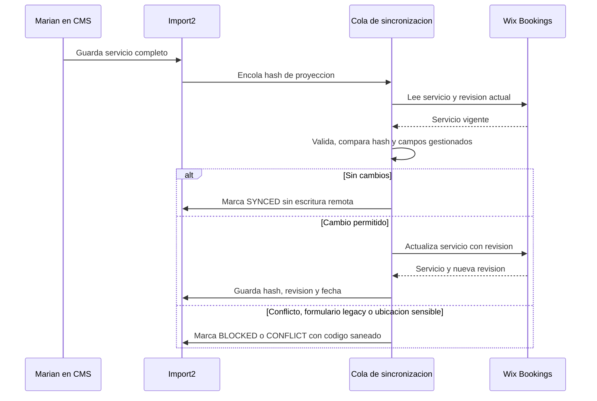

# Mapa canónico de `SERVICIOS_CITA` a Wix Bookings

**Versión propuesta:** `2026-08-26-bookings-service-sync-v1`  
**Dirección de sincronización:** `SERVICIOS_CITA` (`Import2`) → Wix Bookings Services V2.  
**Objetivo:** convertir el catálogo editorial y comercial de Marian en la fuente de verdad de los campos configurables de servicios, sin modificar reservas, sesiones, información de clientes ni detalles históricos.

> **Regla de seguridad:** el catálogo no autoriza una escritura sobre Wix Bookings hasta que el registro tenga `bookingsSyncEnabled = true`, `serviceId` sea válido y todas las dependencias referenciadas estén verificadas. Una actualización incompleta no se degrada a un objeto parcial: queda en cola con un motivo técnico saneado.

## Decisión de arquitectura

La sincronización es determinista, se activa al crear o modificar un servicio y se recupera mediante una cola con ejecución horaria. El hook de CMS invalida cachés y encola una operación idempotente; el trabajador de backend lee el servicio nativo, compara la proyección deseada, actualiza solo los ámbitos asignados y registra el resultado. No se utiliza una tarea de IA ni sondea datos externos.

| Ámbito | Propietario | Motivo |
|---|---|---|
| Textos, precio, canales de pago, estado, categoría comercial, visibilidad, duración editorial, recursos asignables, medios, SEO y configuración de reserva | `SERVICIOS_CITA` | Son decisiones comerciales de Marian y se pueden validar antes de proyectar. |
| ID Wix del servicio, revisión, URLs, slugs generados, fechas nativas y sesiones ya creadas | Wix Bookings | Son datos generados u operativos que el catálogo debe registrar, no fabricar. |
| Disponibilidad real de profesionales, agendas y reservas | Wix Bookings | Es el motor transaccional y de disponibilidad confirmado por el runtime. |
| Formularios de reserva Wix Forms, políticas legacy y sesiones futuras afectadas por una ubicación | Migración explícita y aprobada | Wix documenta cambios de modelo que pueden perder datos de formularios y consecuencias sobre sesiones. [1] [2] |

## Campos requeridos en `SERVICIOS_CITA`

Los campos existentes se mantienen. Los siguientes se añaden en QA con lectura dual mientras se completa la migración. Las claves son técnicas; sus nombres visibles deben ser legibles para Marian.

| Campo CMS | Tipo | Campo o acción Wix | Regla de proyección |
|---|---|---|---|
| `serviceId` | TEXT GUID | `service.id` | Identidad nativa obligatoria. No se crea ni modifica fuera de la operación controlada de alta. |
| `tituloServicio` | TEXT | `name` | Obligatorio; máximo interno 160, compatible con límite Wix de 400. |
| `descripcionLarga` | TEXT | `description` | Máximo interno 6000, compatible con Wix. |
| `resumenCorto` | TEXT | `tagLine` | Máximo interno 120, compatible con Wix. |
| `oculto` | BOOLEAN | `hidden` | Se proyecta de forma directa. |
| `estado` | SINGLE_REFERENCE | Elegibilidad para sincronización y `hidden` | `ACTIVO` permite la sincronización; `INACTIVO` y `BORRADOR` fuerzan `hidden=true` sin borrar el servicio. |
| `categoria` | SINGLE_REFERENCE | Categoría editorial | Debe resolverse mediante `bookingsCategoryId`; no se usa el ID editorial como si fuera ID Wix. |
| `bookingsCategoryId` | TEXT GUID | `category.id` | Obligatorio para hacer visible el servicio en las páginas Wix. |
| `bookingsTipo` | TEXT | `type` | Solo `APPOINTMENT` en la primera versión; clases y cursos requieren un contrato de recurrencia distinto. |
| `bookingsCapacidad` | NUMBER | `defaultCapacity` | Debe ser `1` para citas. |
| `precio` | NUMBER | `payment.fixed.price.value` | Precio positivo: tarifa `FIXED`; precio cero: `NO_FEE`. |
| `moneda` / `monedaCatalogo` | TEXT / REFERENCE | `payment.*.price.currency` | Solo `EUR`. Se prioriza `monedaCatalogo`, con compatibilidad del campo de texto. |
| `pagoOnline` | BOOLEAN | `payment.options.online` | Requiere tarifa `FIXED` o `VARIED`. |
| `pagoPresencial` | BOOLEAN | `payment.options.inPerson` | Debe haber al menos un canal de pago para cualquier servicio. |
| `bookingsRequiereAprobacion` | BOOLEAN | `onlineBooking.requireManualApproval` | No puede combinarse con planes de precios. |
| `bookingsPermiteSolicitudesMultiples` | BOOLEAN | `onlineBooking.allowMultipleRequests` | Valor explícito; no se infiere de la disponibilidad. |
| `bookingsOnlineEnabled` | BOOLEAN | `onlineBooking.enabled` | Por defecto coincide con `estado=ACTIVO` y `oculto=false`, pero puede apagarse explícitamente. |
| `duracionTotal` | NUMBER minutos | `schedule.availabilityConstraints.sessionDurations` | Solo se envía para citas simples sin variantes; el tiempo dual interno no se convierte en sesión nativa adicional. |
| `bookingsBufferMinutos` | NUMBER minutos | `schedule.availabilityConstraints.timeBetweenSessions` | Opcional, entre 0 y el límite del contrato. |
| `personalDisponible` | MULTI_REFERENCE a `MapaStaff` | `staffMemberIds` | Selección canónica obligatoria de personal para una cita; el backend resuelve recursos activos de Bookings sin exponer IDs de miembro. |
| `bookingsStaffResourceIds` | ARRAY_STRING GUID | Compatibilidad temporal | Solo se usa en QA para registros heredados sin `personalDisponible`; no se utiliza en servicios nuevos. |
| `bookingsPrimaryResourceTypeId` | TEXT GUID | `primaryResourceType` | Opcional; se usa solo si la disponibilidad no se basa en el recurso de personal estándar. |
| `bookingsServiceResources` | OBJECT | `serviceResources` | Solo administración avanzada; se valida contra recursos Wix existentes. |
| `imagenPrincipal` | TEXT | Origen editorial | No se envía directamente: se resuelve antes a una referencia de media nativa. |
| `bookingsMedia` | OBJECT | `media.mainMedia`, `coverMedia`, `items` | Debe contener ID Wix, dimensiones y `altText` saneado. |
| `bookingsCustomSlug` | TEXT | `Set Custom Slug` | Sincronización dedicada; nunca se actualiza dentro de `updateService`. |
| `bookingsSeoData` | OBJECT | `seoData` | Opcional y validado contra una lista de claves permitidas. |
| `bookingsLocations` | ARRAY_OBJECT | `Set Service Locations` | No se ejecuta automáticamente si implica eliminar ubicaciones o afectar sesiones. |
| `addonsOptions` | MULTI_REFERENCE | Relación editorial de extras | Alimenta el sincronizador especializado de extras, no el objeto base de servicio. |
| `bookingsSyncEnabled` | BOOLEAN | Guardia de escritura | Falso por defecto hasta prueba de QA por servicio. |
| `bookingsSyncVersion` | NUMBER | Versión de proyección | Cambia si evoluciona el contrato de campos. |
| `bookingsServiceRevision` | TEXT | Revisión nativa | Solo backend escribe el valor obtenido tras una operación correcta. |
| `bookingsLastSyncedAt` | DATETIME | Auditoría | Solo backend. |
| `bookingsSyncHash` | TEXT SHA-256 | Idempotencia | Hash de la proyección permitida, sin datos de cliente. |
| `bookingsSyncStatus` | TEXT | Observabilidad | `IDLE`, `PENDING`, `SYNCED`, `CONFLICT`, `FAILED` o `BLOCKED`. |
| `bookingsSyncErrorCode` | TEXT | Observabilidad saneada | Código enumerado; no guarda mensajes de Wix ni PII. |

## Cobertura de detalle de Wix Bookings

Wix Services V2 expone categoría, textos, media, visibilidad, pago, reserva online, agenda, recursos, personal, ubicaciones, SEO, slug y orden de presentación. Los campos con API dedicada se sincronizan en pasos separados para no alterar datos no cubiertos por `Update Service`. [2] [3]

| Dominio Wix | Operación | Tratamiento del sincronizador |
|---|---|---|
| Servicio base | `getService` + `updateService` con revisión | Actualización parcial de los campos con propietario CMS y comparación previa. |
| Alta inicial | `createService` | Solo mediante acción de administración explicitamente habilitada; devuelve el ID a `serviceId`. |
| Categoría | `updateService` | Usa únicamente `bookingsCategoryId` validado. |
| Personal | `updateService` | Resuelve `personalDisponible` contra `MapaStaff`, valida recursos activos y reemplaza `staffMemberIds` solo después de obtener al menos un recurso. |
| Pago | `updateService` | Construye `FIXED` o `NO_FEE` con canales coherentes; no permite estado ambiguo. |
| Duración y buffer | `updateService` | Se limita a citas simples; variantes requieren sincronizador específico. |
| Media | `updateService` | Exige media Wix resuelta; no descarga URLs remotas ni registra binarios. |
| Slug | `Set Custom Slug` | Operación separada tras validar unicidad. |
| Ubicaciones | `Set Service Locations` | Fase protegida: no elimina ubicaciones ni mueve sesiones sin una acción explícita. |
| Extras | Grupos y opciones de extras | Se ejecuta desde `EXTRAS_CATALOGO` y una futura entidad de grupos; no se envían dentro del servicio base. |
| Variantes | Service Options and Variants | No se activa hasta existir un esquema específico de variantes y precios. |
| Formularios | Wix Forms | Excluido de la primera cola; requiere migración y pruebas dedicadas por advertencia de pérdida de datos. [1] |
| Política de reserva | Política Wix asociada | Se conserva en Wix en la primera fase. Un cambio de políticas necesita un contrato específico y una prueba de sesiones. |
| Calendario, reservas y sesiones | APIs Bookings/Calendar | Nunca se modifican desde una actualización de catálogo. |

## Cola `COLA_SINCRONIZACION_SERVICIOS_WIX`

La colección técnica propuesta tiene ID `BookingsServiceSyncQueue` y no contiene vídeo, datos de clientes ni detalles de reservas.

| Campo | Tipo | Finalidad |
|---|---|---|
| `serviceId` | TEXT GUID | Servicio Wix a sincronizar. |
| `sourceItemId` | TEXT | `_id` del registro `Import2`. |
| `desiredHash` | TEXT SHA-256 | Deduplicación de la proyección. |
| `status` | TEXT | `PENDING`, `PROCESSING`, `COMPLETED`, `RETRY`, `FAILED`, `BLOCKED`. |
| `attempts` | NUMBER | Reintentos acotados. |
| `nextAttemptAt` | DATETIME | Backoff controlado. |
| `traceId` | TEXT | Trazabilidad técnica. |
| `errorCode` | TEXT | Error enumerado y saneado. |
| `createdAt` / `updatedAt` | DATETIME | Auditoría operativa. |

El hook no llama a una API remota dentro de la transacción de escritura del CMS. Encola un registro deduplicado y responde; el job procesa un lote limitado, usa revisión nativa y actualiza el estado. Así una caída de Wix Bookings no bloquea la edición de Marian ni permite perder la intención de sincronización.

## Flujo idempotente

## Controles y límites

| Riesgo | Control obligatorio |
|---|---|
| Sobrescribir cambios recientes | Lectura inmediata y `revision` obligatoria; un conflicto se reintenta tras lectura nueva, con límite. |
| Borrar una configuración no mapeada | `updateService` parcial y lista positiva de campos controlados; el resto se conserva. |
| Servicio visible sin categoría | Bloqueo antes de escritura si falta `bookingsCategoryId`. |
| Pago incoherente | Validación de importe, moneda y al menos un canal de cobro. |
| Personal inválido | Validación de GUID y existencia de recursos antes de escribir. |
| Ubicaciones con sesiones | No se actualizan automáticamente por defecto. |
| Pérdida de formularios legacy | Bloqueo de sincronización de servicios afectados hasta migración Wix Forms verificada. |
| Reintentos infinitos | Límite de intentos, backoff y estado `FAILED` observable. |
| Exposición de información | Códigos de error enumerados, logs sin cargas CMS completas y sin datos de clientes. |

## Aplicación en QA

| Orden | Acción | Evidencia de aceptación |
|---:|---|---|
| 1 | Crear campos nuevos y la cola en QA, sin activar `bookingsSyncEnabled`. | Esquema exportado y permiso administrativo restringido. |
| 2 | Completar `bookingsCategoryId`, personal, media, pago y duración de un servicio de prueba. | Lista de campos obligatorios completa. |
| 3 | Activar sincronización para ese único servicio. | La proyección coincide con Wix y no se modifica ninguna reserva. |
| 4 | Probar actualización de texto, precio, ocultación, personal y pago. | Nueva revisión, hash y estado `SYNCED`. |
| 5 | Probar conflicto de revisión, categoría ausente, formulario legacy y ubicación que se pretende retirar. | Estados `CONFLICT` o `BLOCKED` sin cambios destructivos. |
| 6 | Habilitar servicios uno a uno tras la validación de Marian. | Registro de aprobación y comparación final. |

## Referencias

[1] [Wix Bookings Services Collection Fields](https://dev.wix.com/docs/velo/apis/wix-bookings-v2/services-collection-fields)  
[2] [Wix Services V2: Service Object](https://dev.wix.com/docs/api-reference/business-solutions/bookings/services/services-v2/service-object)  
[3] [Wix Services V2: Update Service](https://dev.wix.com/docs/api-reference/business-solutions/bookings/services/services-v2/update-service)  
[4] [Wix Services V2: Create Service](https://dev.wix.com/docs/api-reference/business-solutions/bookings/services/services-v2/create-service)  
[5] [Wix: About Service Payments](https://dev.wix.com/docs/api-reference/business-solutions/bookings/services/services-v2/about-service-payments)  
[6] [Wix: Set Service Locations](https://dev.wix.com/docs/api-reference/business-solutions/bookings/services/services-v2/set-service-locations)
